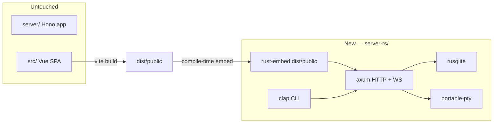

# Hono → Rust migration design

**Date:** 2026-05-27  
**Status:** Approved (packaging: **A — true single binary**)

## Goal

Replace the Node/Hono server with a native Rust binary that:

- Ships as **one executable** (~10–15 MB target) with the Vue UI **embedded** at compile time
- Requires **no Node runtime** and no external `dist/` folder
- Leaves the existing `server/` Hono app **completely untouched** during migration

**User experience:** download → `chmod +x workbench-cli` (Unix) → `./workbench-cli` → open URL in browser.

## Non-goals (this migration)

- Rewriting the Vue frontend
- Changing API shapes consumed by the SPA (contract = `server/schemas/` + existing routes)
- Deleting or modifying `server/` until Rust reaches feature parity

## Current baseline

| Component | Node/Hono today |
|-----------|-----------------|
| HTTP | Hono + `@hono/node-server` |
| WebSocket PTY | `ws` + `node-pty` |
| Database | `better-sqlite3` + Drizzle schema |
| Static UI | `dist/public/` (~4.4 MB) |
| Release size | ~80 MB (natives) / ~140 MB (+ embedded Node) |

## Architecture



**Strangler pattern:** `server-rs/` grows route-by-route until the Rust binary is drop-in equivalent. The Node server remains the reference implementation and test oracle.

## Rust stack

| Concern | Crate |
|---------|-------|
| HTTP + routing | `axum` |
| Static + compression | `tower-http` |
| WebSocket | `axum` + `tokio-tungstenite` or axum WS |
| PTY | `portable-pty` |
| SQLite | `rusqlite` (bundled) |
| TLS / LAN certs | `rustls`, `rcgen` (mkcert integration TBD) |
| CLI | `clap` |
| JSON / validation | `serde`, `serde_json`, `validator` |
| Embedded assets | `rust-embed` |
| Async runtime | `tokio` |

## Repository layout

```
server-rs/              # NEW — parallel Rust server
  Cargo.toml
  README.md
  src/
    main.rs
    cli.rs
    config.rs
    server.rs
    assets.rs
    api/
docs/superpowers/specs/2026-05-27-hono-rust-migration-design.md
server/                 # UNTOUCHED
cli/                    # UNTOUCHED (Node entry; Rust has own main)
```

## API contract

Port routes in this order, matching Hono behavior and response shapes:

1. **Phase 0** — CLI, `GET /api/health`, embedded SPA fallback
2. **Phase 1** — Auth (`/api/auth/*`, session cookie, token gate)
3. **Phase 2** — Settings + keybindings
4. **Phase 3** — Workspace read (projects, worktrees, files)
5. **Phase 4** — Git operations
6. **Phase 5** — Terminals (REST + `/ws` PTY) — highest risk
7. **Phase 6** — Agent hooks, scrollback persistence, TLS/LAN toggle
8. **Phase 7** — CI cross-compile (macOS arm64/x64, Linux x64/arm64)

## Packaging (option A)

| Build | Behavior |
|-------|----------|
| `cargo build --release --features embed-assets` | UI baked into binary; single file release |
| `cargo run` (dev, no embed) | Serves `../dist/public` from disk if present |

Release artifact naming (Herdr-style):

- `workbench-cli-macos-aarch64`
- `workbench-cli-linux-x86_64`

## Verification strategy

- **Contract tests:** HTTP golden files against both Node and Rust servers (same requests → same JSON)
- **Existing Vitest:** `server/**/*.test.ts` remain the oracle; add Rust integration tests that mirror them
- **Manual:** `./workbench-cli` opens UI; terminal attach works after Phase 5

## Risks

| Risk | Mitigation |
|------|------------|
| PTY behavior differs from `node-pty` | Phase 5 last; extensive scrollback/OSC tests |
| SQLite schema drift | Share migration SQL from `server/db/`; read-only copy first |
| Binary size creep | `strip`, LTO, `opt-level = "z"`, audit deps |
| mkcert / LAN TLS | Defer to Phase 6; `--http` for localhost dev |

## Success criteria

- [ ] Single binary runs without Node or sidecar folders
- [ ] Binary size ≤ 15 MB (release, stripped, UI embedded)
- [ ] Full SPA functional against Rust server
- [ ] `server/` directory unchanged on `master` until explicit cutover PR
