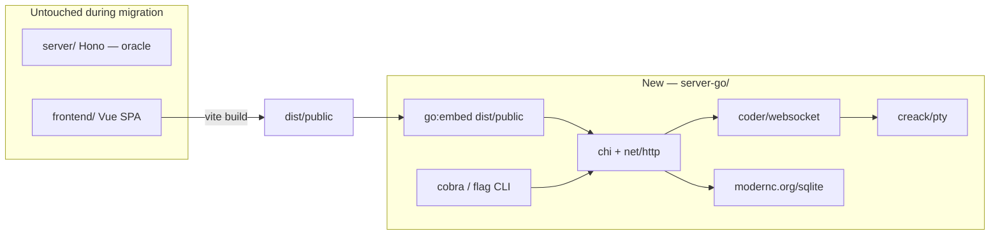

# Hono → Go migration design

**Date:** 2026-05-28  
**Status:** Approved  
**Reference implementation:** `server/` (Hono + Node) — the **only** source to port from  
**Supersedes:** `2026-05-27-hono-rust-migration-design.md` (native-server goal; implementation language is Go, not Rust)

## Goal

Replace the Node/Hono server with a **Go binary** that:

- Ships as **one executable** (~15–25 MB) with the Vue UI embedded via `go:embed`
- Requires **no Node runtime** and no external `dist/` folder in production
- Leaves `server/` **untouched** until Go reaches feature parity (strangler pattern)
- Is **maintained by a Go-proficient owner**

**UX:** download → `chmod +x workbench-cli` → `./workbench-cli` → open URL in browser.

## Non-goals

- Rewriting the Vue frontend
- Changing API shapes the SPA consumes (`server/schemas/`, existing route paths)
- **Any edits under `server/` or `server-rs/`** — both directories are read-only references for the entire migration
- Deleting `server/` or `server-rs/` before a dedicated cutover decision (out of scope for migration work)

## Hard constraint: do not touch `server/` or `server-rs/`

| Directory | Rule |
|-----------|------|
| `server/` | **No modifications.** This is the **Hono reference** — read TypeScript, match behavior. Vitest (`server/**/*.test.ts`) is the oracle. Contract tests spawn `tsx server/index.ts` but never patch these files. |
| `server-rs/` | **No modifications. Not a port source.** Ignore for migration work; do not read or mirror Rust code. |

All implementation, tests, scripts, and CI for the native server belong in **`server-go/`**, root `scripts/`, and root `package.json` only.

## How to port (every phase)

1. **Read** the matching Hono module under `server/` (and `server/schemas/` for request/response shapes).
2. **Run** the existing Vitest file(s) for that module to understand expected behavior.
3. **Implement** the equivalent in `server-go/internal/...`.
4. **Verify** with `go test` + contract harness (same HTTP → same JSON as Hono).
5. **Never** consult or copy from `server-rs/`.

## Current baseline (Node)

| Component | Node/Hono today |
|-----------|-----------------|
| HTTP | Hono + `@hono/node-server` |
| WebSocket PTY | `ws` + `node-pty` |
| Database | `better-sqlite3` + Drizzle (`server/db/schema.ts`) |
| Static UI | `dist/public/` (~4.4 MB) |
| Release | ~80–140 MB (see `PACKAGING.md`) |

## Architecture



**Strangler:** `server-go/` grows route-by-route. The **Hono app** in `server/` + its Vitest tests remain the sole behavioral oracle.

## Go stack

| Concern | Library |
|---------|---------|
| HTTP routing | `github.com/go-chi/chi/v5` |
| WebSocket | `github.com/coder/websocket` |
| PTY | `github.com/creack/pty` |
| SQLite | `modernc.org/sqlite` (pure Go, `CGO_ENABLED=0`) |
| TLS / LAN | `crypto/tls` + existing mkcert flow (port from `server/tls.ts`) |
| CLI | `github.com/spf13/cobra` or std `flag` (match `cli/args.ts`) |
| JSON | `encoding/json` + hand validation or `github.com/go-playground/validator/v10` |
| Embedded assets | `embed` + `io/fs` |
| Logging | `log/slog` |
| Git | `os/exec` — mirror `server/modules/git/*` |

## Repository layout

```
server-go/
  go.mod
  README.md
  cmd/workbench-cli/main.go
  internal/
    cli/           # flags, help text (parity cli/args.ts)
    config/        # ~/.workbench/config.json
    server/        # Listen, TLS, graceful shutdown, WS upgrade
    assets/        # go:embed + SPA fallback
    appstate/      # shared deps (db, settings, pty registry)
    api/           # chi mount /api
    auth/
    settings/
    keybindings/
    workspace/
    git/
    terminal/      # pty registry, handler, osc, ring buffer, scrollback
    agents/
    db/            # migrate, schema from server/db/
  test/
    contract/      # golden HTTP vs Node
    integration/
server/            # READ ONLY — Hono reference + Vitest oracle
```

## API contract (port order)

Mirror the **Hono** routers in `server/api/index.ts` and nested `server/modules/*/router.ts`. Contract types live in `server/schemas/`.

| Phase | Scope | Hono / Node source (`server/`) |
|-------|--------|--------------------------------|
| 0 | CLI, `GET /api/health`, embed SPA, graceful shutdown | `cli/args.ts`, `server/index.ts`, `server/app.ts`, `server/paths.ts` |
| 1 | Auth `/api/auth/*`, session cookie, token gate | `server/modules/auth/*` |
| 2 | Settings + keybindings | `server/modules/settings/*`, `keybindings/*` |
| 3 | Workspace CRUD (projects, worktrees, files) | `server/modules/workspace/*` |
| 4 | Git panel | `server/modules/git/*` |
| 5 | Terminals REST + `/ws` PTY | `server/modules/terminal/*` |
| 6 | Agents, scrollback, TLS/LAN toggle | `server/modules/agents/*`, `server/transport.ts` |
| 7 | CI release matrix (darwin/linux, arm64/amd64) | `PACKAGING.md` |

**PTY design rule (from Hono `pty-registry.ts`):** match attach/detach, scrollback replay, resize, and idle TTL behavior from the Hono implementation. In Go: one goroutine reads each PTY master; fan-out to clients via channels; never hold a registry mutex across I/O (same concurrency goal as fixing contention in a threaded server — implement by reading `server/modules/terminal/pty-registry.ts` and `handler.ts`, plus `docs/terminal-architecture.md`).

## Packaging

| Build | Behavior |
|-------|----------|
| `go build -ldflags="-s -w" -tags embed ./cmd/workbench-cli` | UI baked in; single file |
| Dev (no embed tag) | Serve `../dist/public` from disk if present |

Artifacts:

- `workbench-cli-macos-aarch64`
- `workbench-cli-linux-x86_64`
- (add arm64 linux when needed)

Target binary size: **≤ 25 MB** stripped with embedded UI.

## Verification

| Layer | Tool |
|-------|------|
| Unit | `go test ./...` |
| Contract | `scripts/contract-test.mjs` — same requests → Node vs Go JSON |
| Oracle | Hono Vitest: `server/**/*.test.ts` unchanged — port test cases into Go where practical |
| Bench | Extend `scripts/benchmark.mjs` — TS vs Go columns |
| Smoke | `npm run test:go:smoke` — build UI, build Go, hit health + static |
| Manual | Full SPA + terminal attach after Phase 5 |

## Risks

| Risk | Mitigation |
|------|------------|
| PTY differs from `node-pty` | Phase 5 last; port `pty.test.ts`, `osc-parser.test.ts`, `ring-buffer.test.ts` behaviors |
| SQLite drift | Copy SQL from `server/db/migrate.ts`; same `~/.workbench` data dir |
| Windows PTY | Document non-goal or follow-up; macOS/Linux first (match current focus) |
| Behavior drift from Hono | Contract tests per route; re-run relevant `server/**/*.test.ts` before each phase merges |
| mkcert / LAN TLS | Phase 6; `--http` for local dev |

## Success criteria

- [ ] Single binary runs without Node or sidecar folders
- [ ] Binary ≤ 25 MB (release, stripped, UI embedded)
- [ ] Full SPA works against Go server
- [ ] **Zero diff** in `server/` and `server-rs/` across all migration PRs
- [ ] All new server code and Go tests live under `server-go/`

## Cutover (does not require editing `server/`)

1. Root `package.json` scripts point to the Go binary (`build:go`, `dev:go`, release).
2. Hono server remains in the repo for rollback and contract/oracle tests; run via existing Node entry if needed.
3. `server-rs/` is out of scope for this migration — do not reference or update it.
