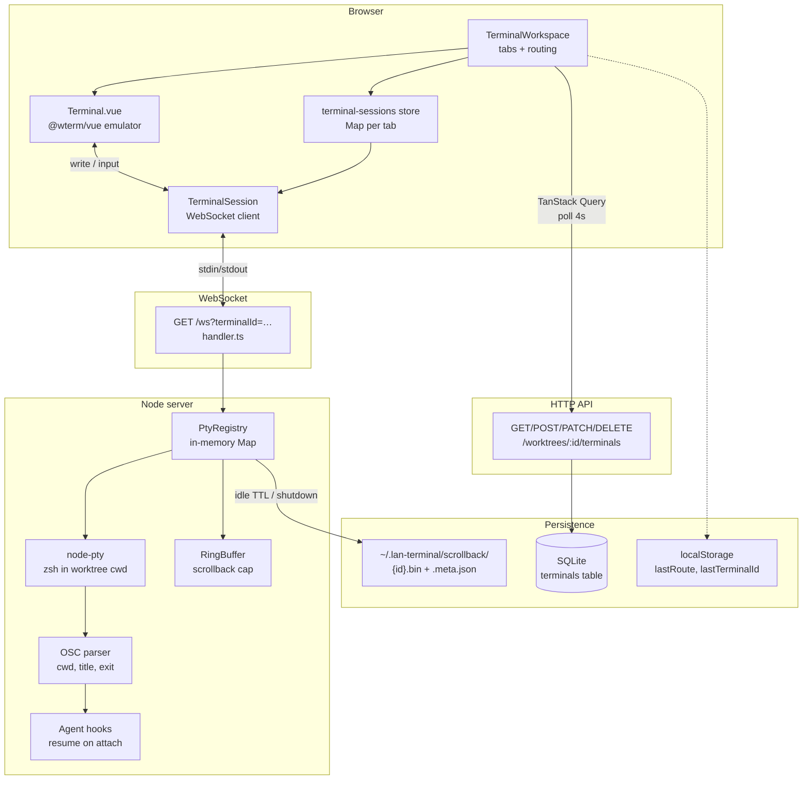
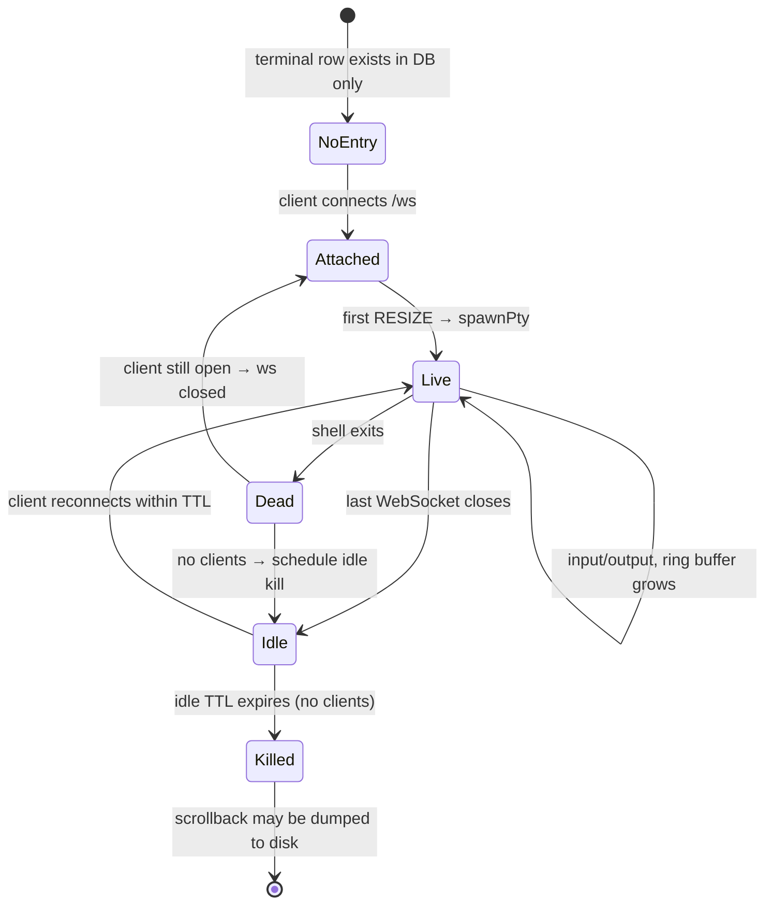

# Terminal architecture

How web terminal tabs connect the browser, HTTP API, WebSocket, PTY, and persistence in lan-terminal.

**Database:** `~/.lan-terminal/data.db`  
**Scrollback files:** `~/.lan-terminal/scrollback/`

---

## Architecture overview



---

## Tab lifecycle (sequence)

```mermaid
sequenceDiagram
    actor User
    participant UI as TerminalWorkspace
    participant Q as terminalsQuery
    participant DB as SQLite terminals
    participant S as TerminalSession
    participant WS as /ws handler
    participant R as PtyRegistry
    participant P as node-pty

    User->>UI: + New terminal
    UI->>DB: POST /worktrees/:id/terminals
    DB-->>UI: { id, title, sortOrder, … }
    UI->>S: sessions.create({ id, terminalId: id })
    S->>WS: WebSocket connect ?terminalId=id
    WS->>DB: getTerminalWithWorktree(id)
    WS->>R: attach(id, ws, { cwd: worktree.path, resume*, agent* })
    R->>R: load scrollback from disk (if any)
    R-->>S: replay ring buffer → ws

    User->>UI: open tab route /w/:wt/t/:id
    UI->>S: sessions.attach(id, WTerm instance)
    S->>WS: ESC[RESIZE:cols;rows]
    WS->>R: handleMessage → spawnPty if needed
    R->>P: spawn shell in worktree cwd

    User->>P: keystrokes via WTerm
    S->>WS: ws.send(input)
    WS->>R: pty.write(raw)
    P-->>R: stdout + OSC sequences
    R-->>S: ws → handleOutput → WTerm.write
    S->>S: parse cwd / title / exit bell
```

---

## PTY runtime state (server)



---

## What lives where

| Layer | What | Where |
|--------|------|--------|
| **Tab metadata** | id, title, sort order, resume command, agent ids | `terminals` table in `~/.lan-terminal/data.db` |
| **UI session** | WebSocket, scrollback buffer, tab label | `TerminalSession` in browser memory |
| **Live shell** | PTY process | `PtyRegistry` Map in server memory |
| **Scrollback** | Last N KB of output | In-memory ring; optional files under `scrollback/` |
| **Navigation** | Last tab / panel | `localStorage` (`lan-terminal:worktree-panels:{worktreeId}`) |

### SQLite `terminals` row (metadata only)

| Column | Purpose |
|--------|---------|
| `id` | Primary key; also used as WebSocket `terminalId` |
| `worktree_id` | FK → `worktrees.id` (shell cwd = worktree path) |
| `title` | Default tab label |
| `sort_order` | Tab order |
| `resume_command` | Optional command to run on cold attach |
| `resume_trusted` | Whether resume command is trusted |
| `agent_kind` | e.g. `claude`, `codex`, `cursor`, `gemini` |
| `agent_session_id` | External agent session for auto-resume |
| `created_at` | Created timestamp |

### Scrollback files (not in SQLite)

Per terminal id under `~/.lan-terminal/scrollback/`:

- `{terminalId}.bin` — raw terminal output bytes
- `{terminalId}.meta.json` — `{ terminalId, cwd, lastActivity, exitCode }`
- `previous/` — copy of last snapshot before overwrite

Written on server shutdown (if enabled) or when PTY is killed after idle TTL.

---

## WebSocket protocol

| Direction | Payload | Meaning |
|-----------|---------|---------|
| Client → server | `\x1b[RESIZE:cols;rows]` | Resize terminal; **spawns PTY on first message** if none exists |
| Client → server | raw bytes / strings | Keystrokes → `pty.write` |
| Server → client | stdout stream | Terminal output + OSC sequences |
| Connect | `wss://host/ws?terminalId={uuid}` | Cookie `sid` required (localhost auto-activates) |

On attach, server replays in-memory ring buffer (and may hydrate from disk first).

---

## Code map

| Step | Path |
|------|------|
| List/create/update/delete tabs | `src/modules/terminal/queries/terminals.ts` |
| Tab bar, routing, session store | `src/modules/terminal/layout/TerminalWorkspace.vue` |
| xterm UI (`@wterm/vue`) | `src/modules/terminal/pages/Terminal.vue` |
| WebSocket client + reconnect | `src/modules/terminal/lib/terminal-session.ts` |
| Per-workspace session Map | `src/modules/terminal/hooks/terminal-sessions.ts` |
| WS upgrade + auth | `server/modules/terminal/handler.ts` |
| PTY, ring buffer, idle kill | `server/modules/terminal/pty-registry.ts` |
| Scrollback read/write | `server/modules/terminal/scrollback-persist.ts` |
| DB CRUD | `server/modules/workspace/terminals.ts` |
| Schema | `server/db/schema.ts` |

---

## Related docs

- [Projects, worktrees, terminals design](./superpowers/specs/2026-05-23-projects-worktrees-terminals-design.md)
- [Vue router tabs](./superpowers/specs/2026-05-24-vue-router-tabs-design.md)
- Database schema: `server/db/schema.ts` (`projects` → `worktrees` → `terminals`)

---

## Important behaviors

1. **WebSocket opens early** — `TerminalSession` connects when a tab row is loaded, not only when the route is visible.
2. **PTY spawns lazily** — Shell starts on first resize message, usually when `Terminal.vue` mounts and attaches the emulator.
3. **Reconnect** — Client clears screen and reconnects WS after 1s on disconnect (unless disposed).
4. **Idle kill** — No WebSocket clients → timer (`ptyIdleTtlHours` from settings) → `registry.kill` → optional scrollback dump.
5. **OSC** — Shell integration reports cwd, window title, and command exit; client updates tab labels and optional success bell.
